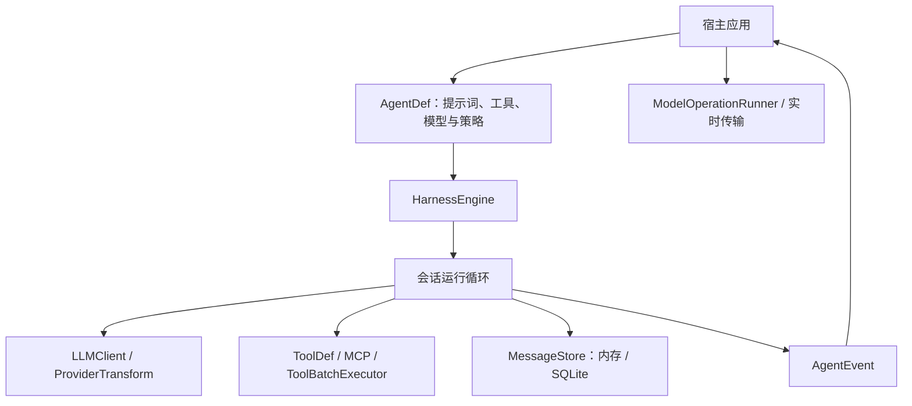

# Agentic SDK

**自主开发、独立演进的 Java Agentic 内核。**

Agentic SDK 为 AI 应用提供统一的会话运行时：模型调用、工具执行、流式事件、
历史持久化、上下文管理，以及等待外部结果后的挂起与恢复。
应用通过定义 Agent、工具和业务策略接入内核，可以构建编程助手、数据分析助手、
内容创作工具或需要长任务协作的 AI 产品。

SDK 的设计与实现借鉴了 [OpenCode](https://github.com/anomalyco/opencode) 的架构和代码。
当前内核由本项目自主开发和维护，按嵌入式 Java SDK 的需求独立演进。

- **运行环境**：Java 21+、Maven 3.8+
- **Maven 坐标**：`com.aliyun.odps:agentic-sdk`
- **许可证**：[Apache-2.0](LICENSE)，第三方归属见 [NOTICE](NOTICE)
- **源码仓库**：[aliyun/alibabacloud-maxcompute-desktop](https://github.com/aliyun/alibabacloud-maxcompute-desktop)

## 内核提供什么

| 能力 | 实现与扩展点 |
| --- | --- |
| 会话与 Agent Loop | `HarnessEngine` 运行模型与工具循环，支持流式、异步、结构化输出、步数限制和结束策略 |
| 持久化与恢复 | `MessageStore` 提供内存和 SQLite 实现，支持稳定会话 ID、消息恢复和 `SessionSnapshot` 导入导出 |
| 工具调度 | `ToolDef` 声明 JSON Schema、结果和附件；只读工具可并行执行，宿主可接入 `ToolBatchExecutor` |
| 业务完成策略 | `RunPolicy` 在模型调用、工具批次与结束边界接入计划、观察、验收和挂起条件 |
| 人机协作 | 权限规则与异步权限询问；活动运行支持取消和插话，挂起后可从已有历史继续执行 |
| 模型协议 | Anthropic、OpenAI Chat Completions、OpenAI Responses、兼容协议及自定义 `LLMClient` / `ProviderTransform` |
| 多模态消息 | `MessagePart` 表达文本、推理、图片、文件引用和工具结果；发送格式由所选协议适配器处理 |
| 上下文管理 | 工具结果裁剪、自动或手动压缩、分块摘要；宿主也可自行管理模型输入投影 |
| MCP 与 Skills | 本地 stdio / 远程 SSE MCP 工具发现，以及 `SKILL.md` 发现、加载和技能白名单 |
| 模型操作生命周期 | `ModelOperationRunner` 统一文本、视觉、图像、视频、音频等操作的开始、进度和终态事件 |
| 实时传输 | `RealtimeWebSocketTransport` 提供双向文本帧传输；供应商的事件解释与音频处理由宿主接入 |
| 观测与回放 | `AgentEvent` 提供文本、推理、工具、权限、压缩、消息落盘和终态事件，供 UI、日志或遥测消费 |

## 架构



内核负责运行与状态推进。宿主负责领域工具、身份认证、业务权限、任务审批、
供应商配置和界面呈现。例如 MaxQuery Studio 将 SQL、项目、画布和 Checkpoint
接入这些扩展点，并把 SDK 消息与事件投影为产品的会话和执行轨迹。

Java 内核不依赖 Spring、Studio 服务端或前端。可选浏览器适配源码位于 `web/`，
目前提供 Citywalk 供应商适配，由宿主的 TypeScript 工程及供应商依赖编译，
不包含在 Maven JAR 中，也尚未作为独立 npm 包发布。

## 快速开始

### 1. 构建并安装

在独立 SDK 仓库根目录运行：

```bash
mvn --version
mvn -B -ntp clean install
```

在 Studio 仓库中，以下命令只构建 SDK 及其所需模块：

```bash
mvn -B -ntp -pl agent-sdk -am install
```

SDK 的 POM 可以独立使用；版本由 `pom.xml` 的 `revision` 属性定义。
Maven Central 的发布流程见 [发布指南](docs/PUBLISHING.md)。
源码和 CI 已配置不代表相应版本已经在 Central 发布；首次发布前请本地安装。

```xml
<dependency>
    <groupId>com.aliyun.odps</groupId>
    <artifactId>agentic-sdk</artifactId>
    <version>${agentic-sdk.version}</version>
</dependency>
```

在应用的 `<properties>` 中将 `agentic-sdk.version` 设置为已安装或已发布的版本。

### 2. 创建并运行 Agent

以下完整示例也保存在 [QuickStart.java](examples/src/main/java/com/aliyun/odps/agentic/example/QuickStart.java)，
编译验证无需模型凭证，实际运行需要配置可用的模型服务。

```java
import com.aliyun.odps.agentic.HarnessEngine;
import com.aliyun.odps.agentic.agent.AgentDef;
import com.aliyun.odps.agentic.agent.AgentDefBuilder;
import com.aliyun.odps.agentic.llm.Model;
import com.aliyun.odps.agentic.llm.ModelLimit;
import com.aliyun.odps.agentic.llm.SseLlmClient;
import com.aliyun.odps.agentic.llm.provider.OpenAICompatible;
import com.aliyun.odps.agentic.session.AgentEvent;
import java.nio.file.Path;

public class QuickStart {
    public static void main(String[] args) {
        Model model = OpenAICompatible.configure("my-provider",
            System.getenv("AGENT_API_URL"), System.getenv("AGENT_API_KEY"))
            .model(System.getenv("AGENT_MODEL"), new ModelLimit(
                Integer.parseInt(System.getenv("MODEL_CONTEXT_TOKENS")), null,
                Integer.parseInt(System.getenv("MODEL_OUTPUT_TOKENS"))));

        AgentDef agent = AgentDefBuilder.create("workspace-assistant")
            .systemPrompt("阅读工作区并回答问题。只使用读取和搜索工具。")
            .includeTools("read", "glob", "grep")
            .maxSteps(20)
            .build();

        HarnessEngine engine = HarnessEngine.builder()
            .workDir(Path.of("."))
            .llmClient(new SseLlmClient())
            .model(model)
            .build();
        try {
            var session = engine.createSession(agent);
            engine.runStreaming(session, agent, "阅读 README 并概括项目用途。", event -> {
                if (event instanceof AgentEvent.TextDelta delta) {
                    System.out.print(delta.delta());
                }
            });
        } finally {
            engine.shutdown();
        }
    }
}
```

`AGENT_API_URL` 必须是完整的 Chat Completions 请求地址；模型 ID、上下文限制和输出
限制应使用实际服务配置。模型目录是随源码维护的快照，接入自定义模型时可以显式覆盖。

### 3. 接入业务能力

| 需要接入的内容 | 推荐入口 |
| --- | --- |
| 自定义工具 | 实现 `ToolDef`，经 `AgentDef.getTools()` 返回或使用 `AgentDefBuilder.addTool()` |
| 全部工具由宿主管理 | 覆盖 `includeBuiltinTools()`，通过 `getToolBatchExecutor()` 接入业务执行流水线 |
| 原样使用宿主提示词 | 覆盖 `getExactSystemPrompt()`；SDK 不再追加环境、指令文件或技能段落 |
| 结束前校验交付结果 | 覆盖 `getRunPolicy()`，返回接受、补充反馈继续执行或挂起的决定 |
| 模型历史独立于 UI 历史 | 注入 `MessageStore`，消费 `MessagePersisted` 等事件进行业务投影 |
| 自定义模型传输 | 实现 `LLMClient`；协议请求和事件转换可实现 `ProviderTransform` |
| 统一媒体调用生命周期 | 用 `ModelOperationRunner` 包裹宿主 HTTP 调用，并接入结果成功判定和事件存储 |

内置工具包括文件读取与编辑、补丁、搜索、Shell、子任务、问询、待办、规划、网页访问和技能加载。
它们按 Agent 的白名单和权限配置提供；领域应用可以完全替换工具目录。
`ToolDef.isReadOnly()` 只有在工具无副作用且可安全并行时才应返回 `true`。

## 长任务、持久化与上下文

- 默认消息存储是内存；需要重启后恢复时，注入 `SQLiteMessageStore` 或自己的 `MessageStore`。
- 使用 `createSession(agent, sessionId)` 重建相同身份的会话，或用 `exportSession` / `importSession`
  传递消息快照；宿主的待审批事项、异步任务和业务上下文需要由宿主另行保存和重建。
- `runUntilPause` 返回 `RunOutcome`。挂起时宿主释放工作线程并等待结果，再调用
  `resumeUntilPause`，无需重复追加原始用户目标。
- `cancel(sessionId)` 协作取消活动运行；`steer(sessionId, agentName, text)` 向活动运行插入消息。
- 默认压缩会改写存储的会话历史。需要完整审计历史时，宿主可通过
  `hostManagesContextProjection()` 接管模型输入投影并使用 SDK 的文本投影与分块摘要工具。
- 流式重试只发生在尚未发布文本、推理或工具调用时，避免将不同尝试拼接成一条执行轨迹。

SDK 的默认提示词与模型名称无关。应用可自定义提示词，模型协议和能力差异通过提供者配置处理。

## 当前边界

- 权限规则是应用集成点。默认 `AsyncPermissionAsker` 对询问请求自动单次放行；
  需要用户确认的产品必须注入自己的异步询问器。自定义工具和宿主执行器应执行相应业务权限检查。
- 多模态消息的可用性取决于模型和协议。`ModelOperationRunner` 管理生命周期，
  具体媒体请求、供应商返回值、轮询与产物保存由接入方提供。
- `MemoryStore` / `FileMemoryStore` 可单独使用；长期记忆尚未自动接入运行循环，
  `HarnessEngine.Builder.memoryConfig()` 当前不产生运行效果。
- `otel/` 目前提供进程内 Span、指标和订阅，不自动导出 OTLP；可从事件流桥接外部遥测。
- SDK 消息快照不包含任意业务数据库、远程任务或 UI 状态；完整产品恢复需要宿主共同完成。

## 开发与验证

```bash
# SDK 测试与构建（独立仓库根目录）
mvn -B -ntp -Djunit.jupiter.execution.parallel.enabled=false clean test

# 验证正式发布所需的 JAR、sources、Javadoc 和消费者 POM
mvn -B -ntp -Prelease-artifacts clean install
python3 scripts/check-release.py --artifacts

# 编译示例
mvn -B -ntp -f examples/pom.xml package
```

GitHub Actions 在 Java 21 和 Java 25 上执行测试、验证发布产物并编译示例。
版本标签发布流程、所需凭证和本地打包命令见 [发布指南](docs/PUBLISHING.md)。

## 源码导航

职责划分与扩展合同见 [内核架构](docs/ARCHITECTURE.md)。

入口是 [`HarnessEngine`](src/main/java/com/aliyun/odps/agentic/HarnessEngine.java)。
`agent/` 定义 Agent SPI，`session/` 实现运行循环与状态，`model/` 定义消息，
`llm/` 处理模型协议，`tool/`、`permission/`、`mcp/` 和 `skill/` 提供执行扩展，
`operation/` 管理非对话模型操作，`patch/` 提供文件补丁能力。

## 许可证与致谢

本项目使用 [Apache-2.0](LICENSE) 许可证。
借鉴了 OpenCode 的架构和代码；第三方版权和许可说明保留在 [NOTICE](NOTICE) 中。
